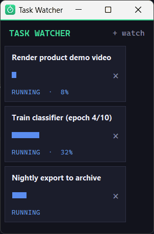

# Task Watcher

[](https://github.com/darkspaz-v1/task-watcher/actions/workflows/ci.yml)

A small always-on-top Windows panel that answers "is it done yet?" for anything long-running, including Claude Code sessions, and pops a toast when a task finishes or fails.

[Quick start](#quick-start) · [What it does](#what-it-does) · [How it works](#how-it-works) · [Claude Code hook](#claude-code-integration) · [Tests and CI](#proof-tests-and-ci) · [MIT license](LICENSE)



*Real capture of the panel window, using invented tasks in a throwaway temp folder (see `docs/media/capture_demo.py`). The Windows toast that fires when a task flips to done is not visible here because only the panel window was captured.*

## Quick start

**Prerequisites:** Windows 10/11 (it uses Win32 file locking and a system tray) and Python 3.12 or 3.13, the versions CI tests.

```
py -m venv venv
venv\Scripts\pip install -r requirements.txt
run.bat
```

Create the virtualenv and install once; after that `run.bat` starts the tray app using `venv\Scripts\pythonw.exe`. A `tasks` folder appears next to `app.py`.

Then report a task by saving a JSON file into that `tasks` folder, for example `tasks
ightly-export.json`:

```json
{"label": "Nightly export", "status": "running", "progress": 40}
```

The panel picks it up within a second. Rewrite the file with `"status": "done", "progress": 100` and the row turns green and a toast fires. `status` is one of `running`, `waiting`, `done`, `failed`; `progress` is 0-100, or `null` for an indeterminate bar. Add `"updated_at": "2026-01-31T14:05:00"` (local time) if you want the 30-minute auto-fail below to apply, since staleness is measured from that field.

Or click **+ watch** in the panel and enter a PID or process name (for example `ffmpeg.exe`).

## What it does

- One always-on-top panel plus a tray icon, with one progress row per task.
- **Watch a process** by PID or name. Progress is shown as indeterminate, because liveness alone cannot tell you how far along something is.
- **Drop a JSON file** into the `tasks` folder with `progress` (0-100) and `status`. Anything that can write a file can report into this.
- Fires a Windows toast the moment a task flips to done or failed.
- **Auto-fails a task after 30 minutes with no update** (`stale_after_minutes` in `config.json`), so an abandoned job does not sit at 40 percent forever pretending to be alive.
- Launching it a second time brings the running panel forward instead of starting a duplicate.

## How it works

- `app.py` runs a poll loop on its own thread that re-reads the `tasks` folder every second and hands the result to the Tk thread through a queue; worker threads never touch Tk directly.
- `tasks_io.py` writes task files atomically (per-process temp file plus `os.replace`) so a reader never sees a half-written file, even when two hook calls land together.
- `task_row.py` draws one row per task with a colour per status.
- `watcher.py` checks process liveness with `psutil`.

**Liveness is not percentage progress.** A running process tells you it is alive, not how far along it is, so process watches show an indeterminate bar rather than an invented percentage. Only a task that reports its own `progress` gets a determinate one.

## Claude Code integration

`hook_bridge.py` is wired into Claude Code hooks (`~/.claude/settings.json`), so every session reports
its own progress into this panel with no per-session setup. A session has no real percentage either, so the bridge estimates: each tool event adds 5 points up to a cap of 90, a "needs your attention" notification sets the row to waiting, and the session's Stop event sets it to done at 100. The bridge is written to stay silent and exit 0 on any bad input, so it cannot break the session that calls it.

**Stack:** Python, Tkinter, `pystray`, `winotify`, `psutil`, Pillow.

## Proof: tests and CI

```
venv\Scripts\pip install -r requirements-dev.txt
venv\Scripts\python -m pytest
venv\Scripts
uff check .
```

The tests cover the pure logic: the `tasks/` file read/write round trip, the hook-event parsing in
`hook_bridge.py` (including a subprocess test that the hook stays silent and exits 0 on bad input), and
process liveness checks. They use a temp folder and never touch your real `tasks/` folder or open a window.
CI (`.github/workflows/ci.yml`, the badge above) runs the same two commands on Windows with Python 3.12 and 3.13.

## Known limitations

- Windows only. The tray icon, toasts and single-instance lock all depend on Windows APIs.
- The GUI itself (panel layout, toasts, tray) is not covered by automated tests; only the logic behind it is.
- A watched process is always marked done when it exits, never failed, because exit alone says nothing about success. Use a JSON task file if you need that distinction.
- Config lives in `config.json` and is read at startup. Edit it, then fully exit the tray icon and relaunch.

## Part of a suite

One of seven small Windows tray utilities built as separate, self-contained apps: each has its own
folder, its own virtualenv and its own `run.bat`, with no shared runtime. They are deliberately not a
framework — the only thing they share is a set of conventions.

| Convention | Why |
|---|---|
| Single-instance guard via a `.singleton.lock` file | An earlier `.instance.lock` design could get stuck after a force-kill and leave the app permanently unlaunchable |
| Relaunch brings the existing window forward | Previously a second launch silently did nothing, which was indistinguishable from the app being broken |
| Config lives in `config.json`, read at startup | Edit it, then fully exit the tray icon and relaunch — a running process never re-reads it |
| Tray icon generated in code (`icon.py`) | No binary asset to keep in sync |

## Troubleshooting

Log file location: `logs/task-watcher.log` next to `app.py` (rotating, 1 MB x 3); the Claude Code hook writes
its own `logs/hook_bridge.log` and only when something goes wrong. Set `APP_LOG_LEVEL=DEBUG` before launching
to also record errors the app deliberately ignores (for example a failed toast notification). A crash traceback
goes to `app_error.log`.

## License

MIT — see [LICENSE](LICENSE).
